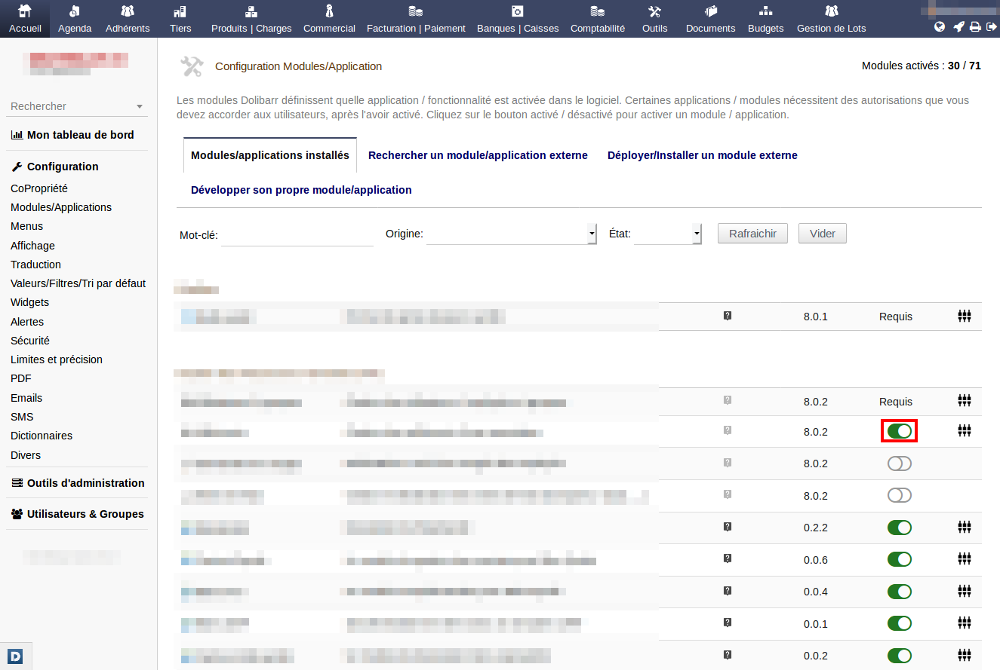
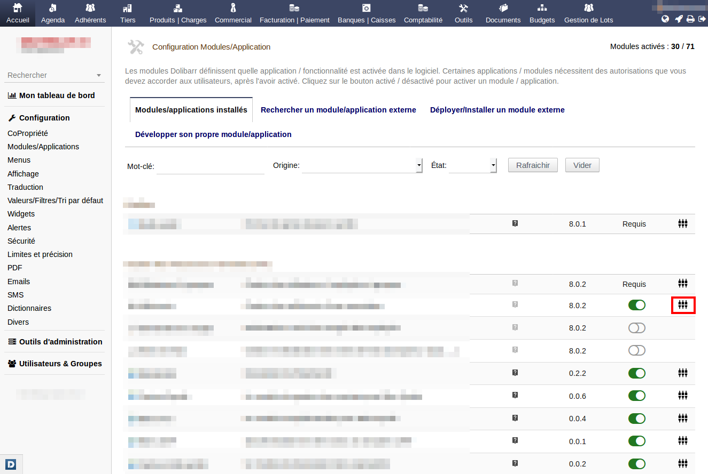

# Dolibarr

[Dolibarr ERP & CRM](https://www.dolibarr.org/) is a modular software (you only activate the features you want) for management of TPE/SME, independent or associations. It is an OpenSource project that runs within a Web server (Apache, MySQL, PHP) and can therefore be accessed from any place with an Internet connection.

## Modules

Dolibarr has a wide variety of modules to extend and expand its functionalities. To access the list of modules, simply log in to Dolibarr and go to the menu **Configuration** > **Modules/Applications**.

### Install a module

There are 2 ways to install a module.

- The first is to install it directly using a package (a package is simply an archive **.zip** containing all the files of the module).

- The 2nd way is to add the module folder (containing all its files) in the Dolibarr root folder (**htdocs**) or in the custom folder (**htdocs/custom**).

### Enable / Disable a module

To enable or disable a module on Dolibarr nothing more simple, just operate the switch on the right of each module.

### Configure a module

Most modules have configuration settings that allow you to change their behavior. You will find a link next to each activated module that will redirect you to its configuration page.

## Documentation

The official documentation of Dolibarr can be consulted from the following link: [www.dolibarr.org/documentation-home](https://www.dolibarr.org/documentation-home).
